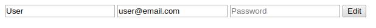

# Project: Bare metal forms with Rails

> This project is intended for practice the different ways to build a form in rails that can send parameters to a controller
> so that it can build an instance of a model with those parameters.

### Technology

Ruby - Rails - ActiveRecord - PostgreSQL - SQLite 

### Authors

👤 **Oscar De La Lanza**

- Github: [@oscardelalanza](https://github.com/oscardelalanza)
- Twitter: [@oscardelalanza](https://twitter.com/oscardelalanza)
- Linkedin: [Oscar De La Lanza](https://linkedin.com/in/oscardelalanza)
- Email: [oscardelalanza@gmail.com](mailto:oscardelalanza@gmail.com)

👤 **Tiago Ferreira** - [@ferreirati](https://github.com/ferreirati)

### Links

- **Assignment page** - [The Odin Project](https://www.theodinproject.com/courses/ruby-on-rails/lessons/forms)
- **Live** - [Demo on Heroku](https://sleepy-caverns-46639.herokuapp.com/)

### Database structure

- users
  - name: STR, required, max:80
  - email: STR, required, index, unique, max:255
  - password_digest: STR

### Scaffolding commands

- `rails g scaffold User name:string email:string password_digest:string`

### Set Up

To clone the project in your local environment do the following.

- Open a new `terminal` window and navigate to the directory where the project will be stored.
- Run the command `git clone git@github.com:oscardelalanza/mv-rails-04-bare-metal.git`.
- Run the command `cd mv-rails-04-bare-metal` to enter the project directory.

### Installation

- Install the required gems running the command `bundle install --without production`.
- Install the required node modules running the command `yarn install --check-files`.
- Create and migrate the database running the command `rails db:migrate`.

### Usage

- Go to the path `users/new` in your local server to get access to the form. 

### Deployment

- To start the local server run the command `rails server`.

### Run tests

- Run the command `rails tests`.
